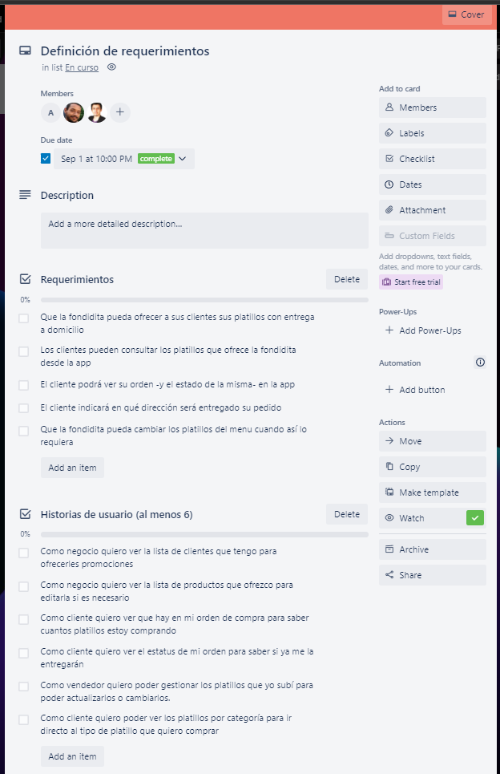
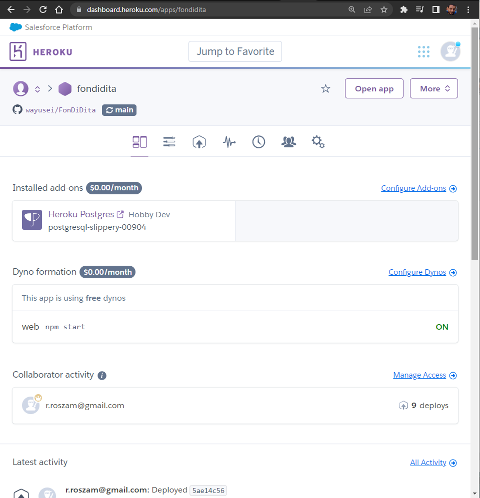
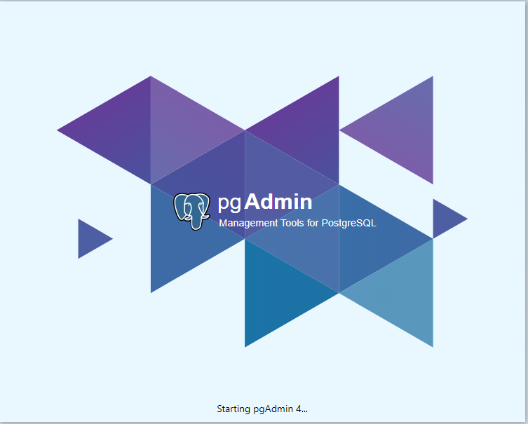
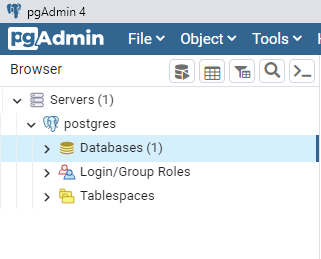
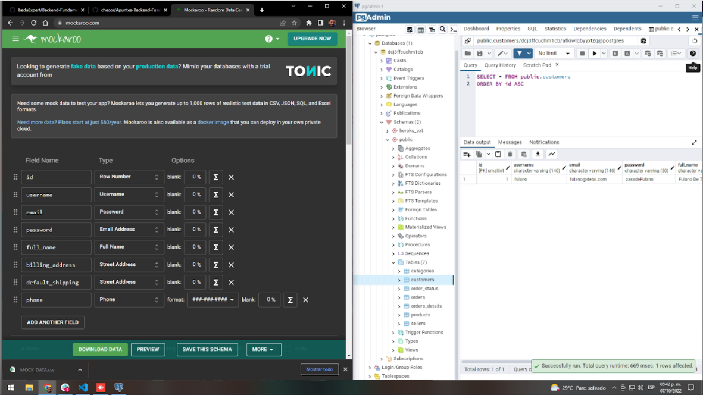
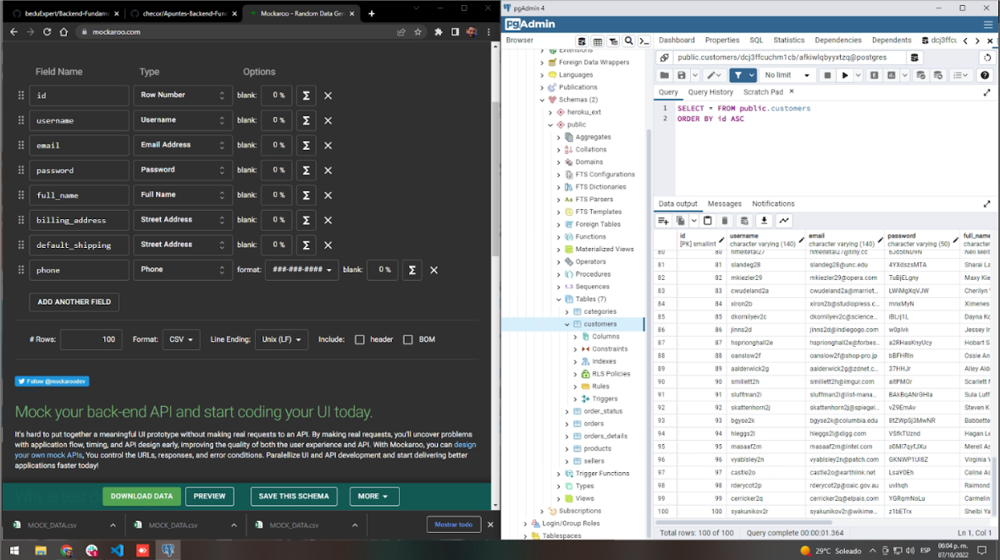
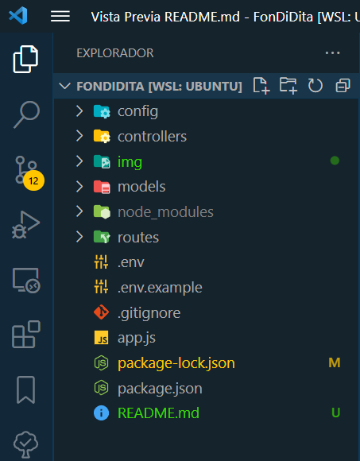
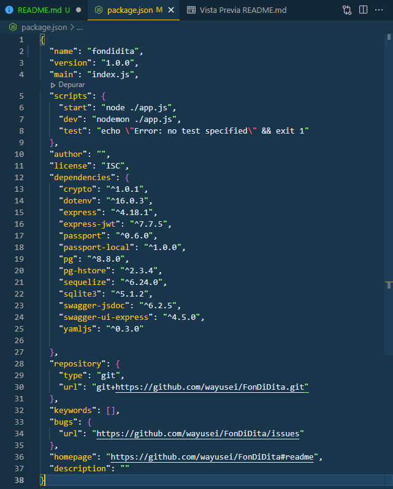
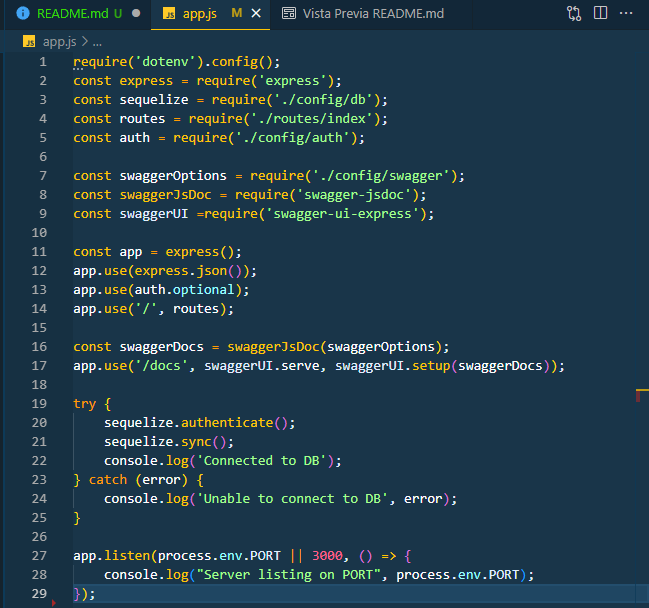

# FonDiDita

*Evaluación del módulo Backend Fundamentals, Desarrollo Web | Santander Universidades*

## Entregables Postwork 1

### Objetivos generales
 
  
### Tablero en Trello

 https://trello.com/invite/b/Dbsk87SN/3173285b96dfddc3d4848424566af0ee/fondidita
  
 (imagen)

### Definición de herramientas 

Se generó una imagen utilizando el app Terrastruct (https://app.terrastruct.com/)

 (imagen hecha en Terrastruct)

 Herramientas utilizadas: ¿Qué son y para qué sirven?

 - PostgreSQL( Es un sistema de código abierto de administraciòn de bases de datos del tipo relacional y no relacional, gratuito con data types avanzados y permite ejecutar optimizaciones de rendimiento avanzadas como si fuera un sistema de base de datos comercial)
 - JavaScript(Es un lenguaje de programaciòn ligero, interpretado, o compilado ‘justo-a-tiempo’ (just-in-time) con funciones de primera clase, basado en prototipos, multiparadigma, de un solo hilo, dinámico, con soporte para POO, imperativa y declarativa.Sirve para scripting en páginas web, en entornos fuera del navegador como Node.js, Apache CouchDB y Adobe Acrobat)
 - Node.js(Es un entorno de ejecución para Javascript construido con V8, motor de Javascript de Chrome, es open source, multiplataforma y se ejecuta del lado del servidor, sirve para crear sitios web dinámicos muy eficientes usando JS)
 - npm(NPM corresponde a las siglas de Node Package Manager, manejador de paquetes de node, sirve para compartir e instalar paquetes de software entre distintos proyectos que utilicen Node.JS)
 - Sequelize(Es un ORM, Object-Relational Mapping - mapeo objeto-relacional, sirve para manipular varias bases de datos SQL de una manera bastante sencilla, utilizando JS en este caso.)
 - Express.js(Es un framework backend minimalista, diseñado para construir una aplicación de manera ágil, sirve para proporcionar funcionalidades como el enrutamiento, opciones para gestionar sesiones y cookies, etc.)
 - Github(Es un portal creado para alojar el código de las aplicaciones de cualquier desarrollador que utiliza el sistema de control de versiones Git, es multiplataforma y tiene multitud de interfaces de usuario, sirve para que los desarrolladores suban el código de sus aplicaciones y herramientas)
 - Heroku(Es una plataforma de servicios en la nube (PaaS, Platform as a Service) que permite manejar los servidores y sus configuraciones, escalamiento y la administración)
 - Además utilizamos para comunicarnos la plataforma de videoconferencias Zoom, la aplicación de mensajería instantánea WhatsApp, la aplicación Trello y la plataforma Google Drive para mediante un documento compartido apoyarnos a la redacción de este documento.

### Historias de usuario

    

Las historias de usuario que se definieron fueron las siguientes:

- *Como* negocio *quiero* ver la lista de clientes que tengo *para* ofrecerles promociones.
- *Como* negocio *quiero* ver la lista de productos que ofrezco *para* editarla si es necesario.
- *Como* cliente *quiero* ver que hay en mi orden de compra *para* saber cuántos platillos estoy comprando.
- *Como* cliente *quiero* ver el estatus de mi orden *para* saber si ya me la entregarán.
- *Como* vendedor *quiero* poder gestionar los platillos que yo subí *para* poder actualizarlos o cambiarlos.
- *Como* cliente *quiero* poder ver los platillos por categoría *para* ir directo al tipo de platillo que quiero comprar.

### Identificación de los modelos del proyecto
#### Cada uno con sus caracteísticas específicas, dentro de una arquitectura MVC

    (aqui)

## Entregables Postwork 2

1. Definir diagrama ERD ✔

2. Crear proyecto en plataforma Heroku ✔
   
   

3. Agregar Add-on Heroku postgres ✔
   
4. Conectar usando PGAdmin4 al servidor de Heroku ✔
   
   
5. Traducir modelo relacional a esquema de base de datos ✔
   
6. Utilizar Mockaroo para generar un dataset y poblar la base de datos con él. ✔
   
   Después de la carga:
   
7. Escribir al menos 5 consultas a tu base de datos en donde se usen los conceptos vistos en la sesión y el nuevo conocimiento del postwork. ✔

## Entregables Postwork 3

- Generar el esqueleto del proyecto ✔
  
- instalar dentro de proyecto todas las dependencias y paquetes necesarios para que funcione correctamente. ✔
  
- Utilizar las credenciales de Heroku para la base de datos de tu proyecto, en el archivo app.js para la conexión con la base de datos. ✔
- Probar la conexión haciendo las consultas que se definieron en la sesión 2 a través de sequelize. ✔

## Entregables Postwork 4

1. Define la configuración de Express en el archivo app.js de tu proyecto (en equipo) de la misma forma que se hizo en el work para el proyecto BeduShop. ✔
   
2. Verifica que funcione correctamente corriendo tu proyecto y haciendo una peticion GET a la URL base desde Insomnia. ✔
3. Selecciona una de las tablas de la base de datos de tu proyecto y define el CRUD completo para esa entidad. ✔
4. Prueba los servicios que realizaste en el inciso anterior. ✔
5. Define un nuevo servicio GET que sea una búsqueda por ID (o el campo de llave primaria) ✔
6. Pruébalo en Insomnia. ✔
7. Define un servicio que sólo traiga ciertos campos de la tabla, estos campos deben ser seleccionados por el cliente y pasados en la petición.
8. Prueba el servicio del inciso anterior. ✔
9.  Haz capturas de pantalla/graba tu pantalla a modo de evidencias y compártelas en el canal de Slack de tu grupo. De igual manera, consérvalas para presentar tu entregable en el Checkpoint. ✔

(screenshots insomnia)

¿Qué pasaría si seguimos definiendo todos los servicios en el archivo app.js?
 
(respuesta)

¿Crees que representa un problema?¿Por qué?
 
(respuesta)

## Entregables Postwork 5

- Reestructurar el código del proyecto usando los directorios definidos para controladores y modelos.
- Definir un router para cada una de las entidades del proyecto.
- Crear un archivo routers/index.js y agregar la configuración de los routers definidos.
- Agregar la configuración de router al archivo app.js del proyecto para que funcionen los endpoints definidos. Recuerda poner en la URL base la versión actual del proyecto v1.
  

## Entregables Postwork 6
1. Instala el paquete crypto en tu proyecto personal
2. De todos los datos presentes en tu base de datos identifica aquellos que sean sensibles o que no deberían ser guardados de forma plana.
3. Utilizando la investigación realizada en el prework de la sesión elige cual es el mejor método para proteger estos datos.
4. Utiliza la biblioteca crypto para proteger los datos sensibles de la base de datos.

## Entregables Postwork 7
1. Definir la configuración de Passport para tu proyecto. Puedes usar una muy similar a la vista en el work para BeduShop.
2. Controlar el acceso a los servicios de tu API para que solo los usuarios autorizados puedan acceder a ellos. Para esto considera:
   - Definir un conjunto de servicios públicos y un de servicios privados.
   - Definir un control de acceso a información o filtros de control sobre la información que regresa el servicio según el nivel del usuario que lo consulta.
   - Definir un organigrama con privilegios bien definidos para cada tipo de usuario.
3. Cambiar las rutas de los servicios que sean necesarios para modelar este control de acceso.

## Entregables Postwork 8
1. Definir las variables de entorno necesarias para ocultar la información confidencial de la aplicación en un archivo (env.sh).
2. Crear las variables en la computadora y probar que la aplicación funcione correctamente de forma local.
3. Crear un repositorio de GitHub con el código de la aplicación. Recuerda no subir datos de conexión ni el archivo de definición de las variables de entorno (env.sh).
4. Usando Heroku, en el mismo proyecto donde tienes la base de datos, deberás hacer deploy de la aplicación por medio del repositorio de GitHub.
5. Probar los servicios de tu aplicación en producción.
6. Crear un Swagger con la documentación de los servicios.

## Integrantes del equipo de FonDiDita :construction_worker:

- Ángel Alberto Pimentel
- Rodrigo Rosas
- Sergio Monterrubio
